# H1 Sniff

## x)  
- Karvinen 2025: Wireshark - Getting Started  
 Pikainen apuohje Wiresharkin käyttöönotosta.  

- Karvinen 2025: Network Interface Names on Linux  
Ohjeita verkkoliitäntöjen lyhenteiden merkityksistä.  
    

## b) Osoita, että pystyt katkaisemaan ja palauttamaan virtuaalikoneen Internet-yhteyden.  

Alku testit internet yhteydelle.  
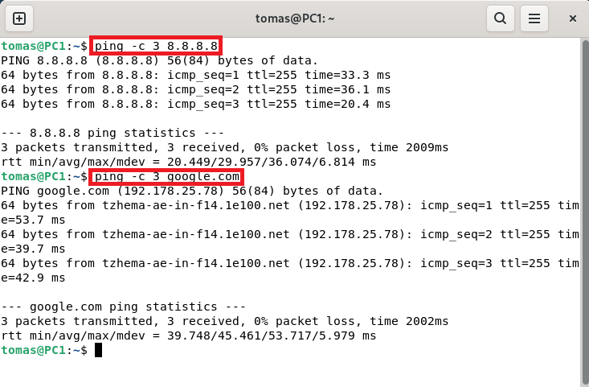  

Yhteyden katkaisu.  
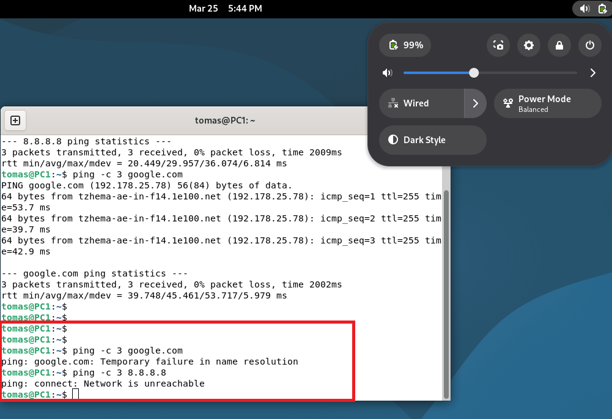  

Yhteyden palautus.  
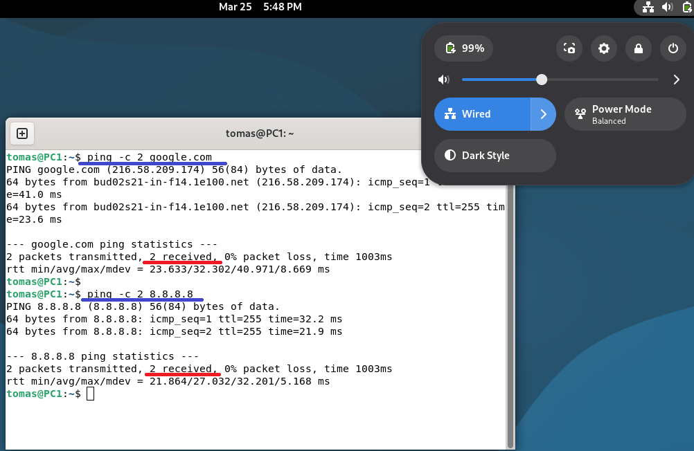

## c) Asenna Wireshark. Sieppaa liikennettä Wiresharkilla.  
Firefox selaimen avulla tehty haku.  
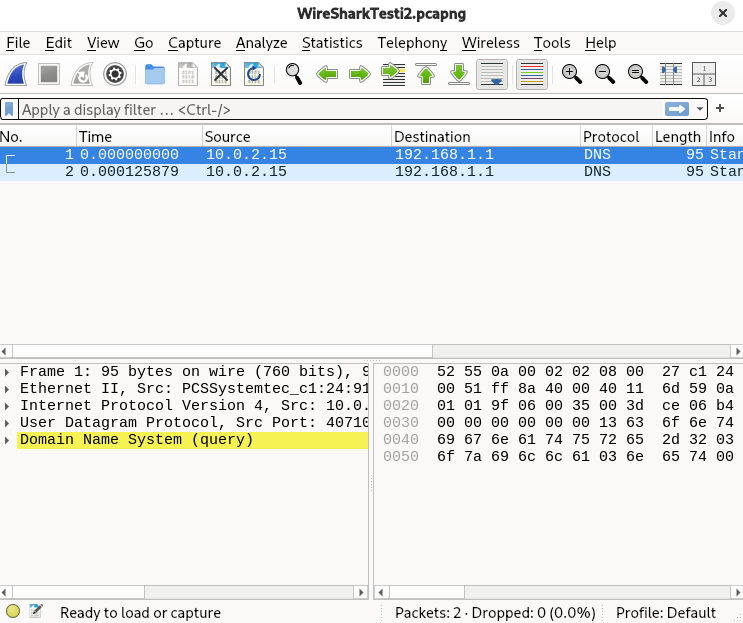  

## d) Osoita TCP/IP-mallin neljä kerrosta yhdestä siepatusta paketista.  
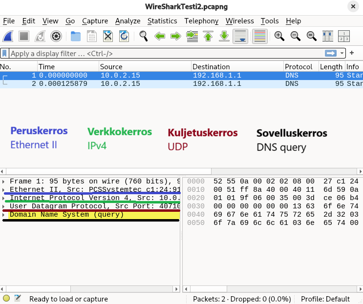  

## e) Avaa surfing-secure.pcap. Tutustu siihen pintapuolisesti ja kuvaile, millainen kaappaus on kyseessä.  

  
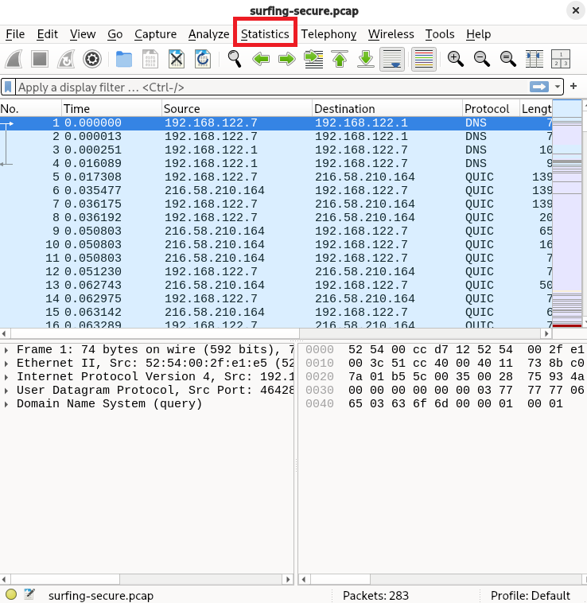

Statistics -> Endpoints  
Tästä nähdään laitteiden määrä. 2 laitetta.  
palvelin & käyttäjä  
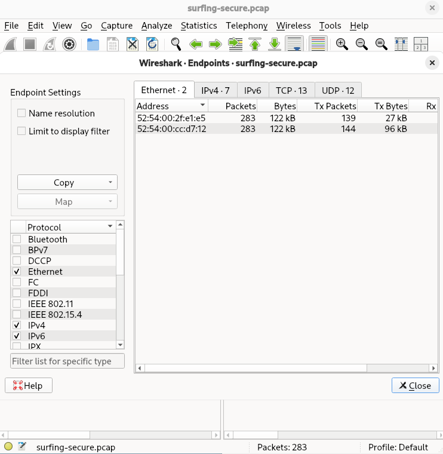

Statistics -> Protocol Hierarchy
Nähdään eri liikenteiden määrä. HTTP, DNS, TCP, UDP ja muut.  
Suurinosa paketeista TCP/UDP. Dataa kulkee paljon salattuna.  
Kyseessä mahdollisesti tavallisesta internet selailusta.  
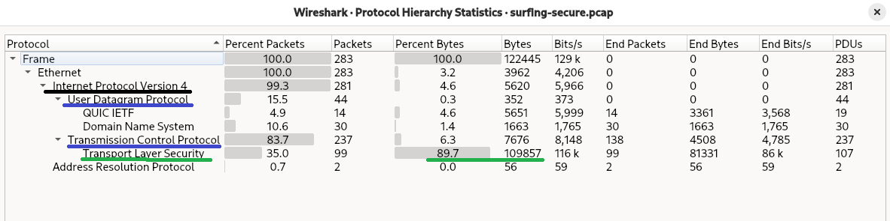

## g) Minkä merkkinen verkkokortti käyttäjällä on?  
QEMU. Kyseessä on virtuaaliverkkokortti.  
Oletus tästä tulee osoitteen alusta "52:54:00"  
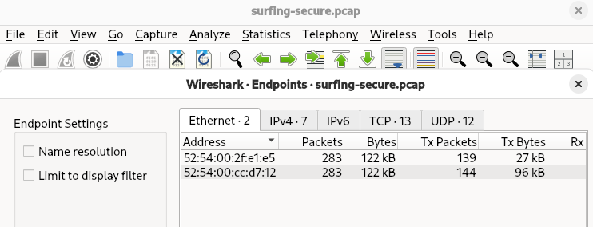  

## h) Millä weppipalvelimella käyttäjä on surffaillut?  
Otin kohdeosoitteen ja tein WHOIS komennolla selvityksen IP:n omistajasta.  
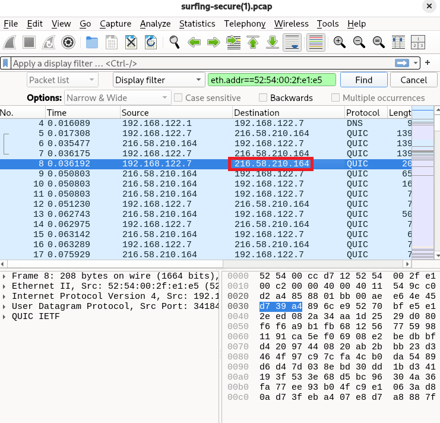  

Joka on Google. Joten käyttäjä on käyttänyt Googlen palveluita.  
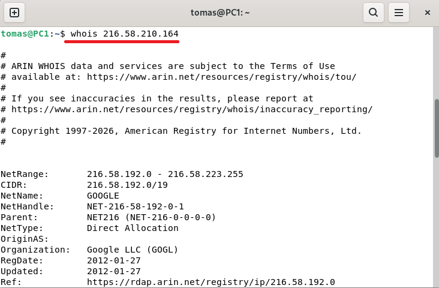  

## i) Analyysi. Sieppaa pieni määrä omaa liikennettäsi.  
Kyseessä tilanne, jossa käynnissä oleva webbiselain suljetaan. Vain 3 pakettia siepataan.  
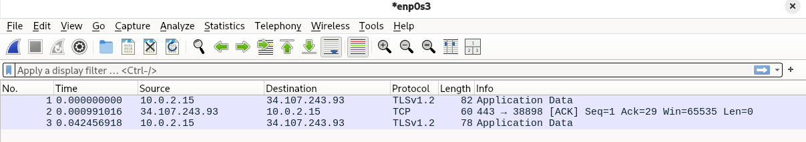  
