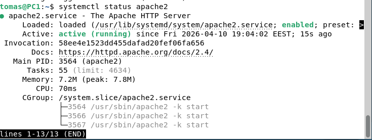
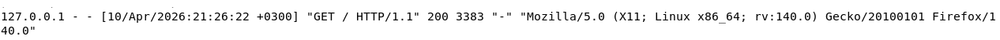
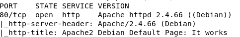
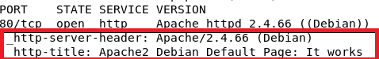

# H2  

## x) 1. Selitä tuskan pyramidin idea 1-2 virkkeellä.  
      - Tuskan pyramidi on pyramidi, johon sisältyy eri tasojen kipupisteitä.  
      - Siihen kuuluvat osat ovat eri arvoisia tietoteknisia instrumentteja,  
        joiden pysäyttäminen tuo kipua riippuen näiden tärkeydestä.  
Lähde: https://detect-respond.blogspot.com/2013/03/the-pyramid-of-pain.html  
 
 
## 2. Selitä timanttimallin (Diamond Model) idea 1-2 virkkeellä.  
    - Timanttimallissa on 4 elementtiä, eli hyökkääjä, infastruktuuri, kyvykkyys ja uhri.  
    - Timanttimallin avulla voidaan analysoida hyökkäyksiä näiden neljän alueen avulla.  
Lähde: https://www.threatintel.academy/wp-content/uploads/2020/07/diamond-model.pdf  
 
 
## a) Apache log. Asenna Apache-weppipalvelin paikalliselle virtuaalikoneellesi. Surffaa palvelimellesi salaamattomalla HTTP-yhteydellä, http://localhost . Etsi omaa sivulataustasi vastaava lokirivi.  
Pikainen apachen asennus. Asennus onnistui ja apache2 käynnistyi.  
  
 
Pääsin lokiriviin komennolla "sudo cat /var/log/apache2/access.log"  
 
lokirivi: 127.0.0.1 - - [10/Apr/2026:21:26:22 +0300] "GET / HTTP/1.1" 200 3383 "-" "Mozilla/5.0 (X11; Linux x86_64; rv:140.0) Gecko/20100101 Firefox/140.0"  
  
 
Tässä lokirivi pilkottuna osiin:  
 
127.0.0.1 = client/asiakkaan IP  
Kohdassa: "- -" = Ei tunnistettu käyttäjää tai kirjautumista  
[10/Apr/2026:21:26:22 +0300] = Aika milloin pyyntö aloitettiin  
GET / HTTP/1.1 = Avataan palvelimen oletussivu ja käytetään protokollaa http versio 1.1  
200 = Ok  
3383 = Palvelimen vastauksen koko tavuina  
Kohdassa: "-" = Refrenssi sivu, eli miltä sivulta tultiin tälle sivulle  
Mozilla/5.0 = Selain on moderni  
(X11; Linux x86_64; rv:140.0) = Asiakkaan kone on Linux  
Gecko/20100101 Firefox/140.0 = Firefoxin renderöintimoottori ja Firefoxin versio  

## b) Porttiskannaa oma weppipalvelimesi käyttäen localhost-osoitetta ja 'nmap -A' päällä  
Asensin aluksi työkalun nmap ja käytin komentoa "sudo nmap -A localhost"  
  
Tästä nähdään portin 80/tcp olevan auki.  
Eli apache palvelin on päällä ja tämän prosessi kuuntelee http pyyntöjä portissa 80.  

## c) Mitkä skriptit olivat automaattisesti päällä, kun käytit "-A" parametria?  
  
Niitä oli kaksi.  
http:llä alkavat "http-server-header" ja "http-title"  
 
http-server-header katsoo http vastauksesta palvelimen tunnisteet, kuten palvelimen tyypin ja version.  
http-title kertoo. mikä sivu avautuu.   

## d) Etsi weppipalvelimen lokeista jäljet porttiskannauksesta. Etsi kohdat, joilla on sana "nmap" ja kommentoi niitä.  
