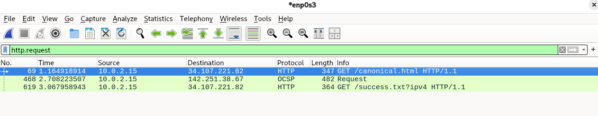
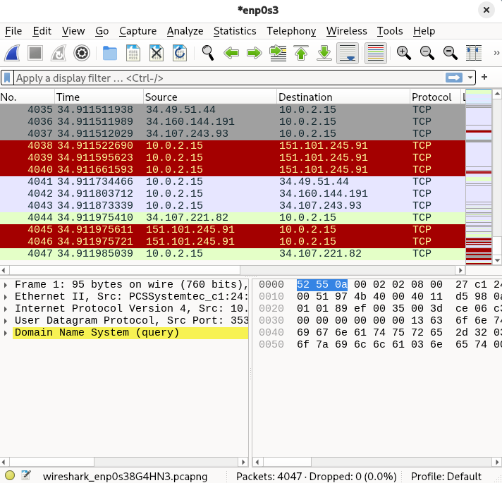
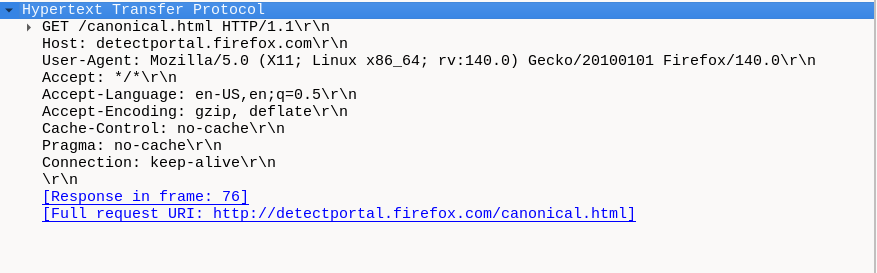

# H2  

## x) 1. Selitä tuskan pyramidin idea 1-2 virkkeellä.  
      - Tuskan pyramidi on pyramidi, johon sisältyy eri tasojen kipupisteitä.  
      - Siihen kuuluvat osat ovat eri arvoisia tietoteknisia instrumentteja,  
        joiden pysäyttäminen tuo kipua riippuen näiden tärkeydestä.  
Lähde: https://detect-respond.blogspot.com/2013/03/the-pyramid-of-pain.html  
 
 
## 2. Selitä timanttimallin (Diamond Model) idea 1-2 virkkeellä.  
    - Timanttimallissa on 4 elementtiä, eli hyökkääjä, infastruktuuri, kyvykkyys ja uhri.  
    - Timanttimallin avulla voidaan analysoida hyökkäyksiä näiden neljän alueen avulla.  
Lähde: https://www.threatintel.academy/wp-content/uploads/2020/07/diamond-model.pdf  
 
 
## a) Apache log. Asenna Apache-weppipalvelin paikalliselle virtuaalikoneellesi.  
Pikainen apachen asennus. Asennus onnistui ja apache2 käynnistyi.  
  
Avasin Wiresharkin ja aloitin kaappaamaan liikennettä ilman lisäasetuksia.  
Tämän jälkeen otin yhteyden Firefox selaimella juuri luomaani palvelimeen käyttäen virtuaalikoneen IP-osoitetta.  
Suljin selaimen ja lopetin kaappauksen.  
  
  
  

