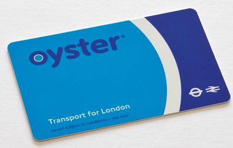

# NFC ja RFID
 

## a) Tarkastele käytössäsi olevia RFID tuotteita, mieti miten hyvin olet suojautunut RFID urkinnalta?  
Itsellä käytössä olevia RFID tuotteita ovat:  
- maksukortit
- älypuhelin

 

### Maksukortti
Maksukorteissa on NFC-siru, jonka avulla lähimaksuja voidaan suorittaa.  

Hyökkääjä voisi yrittää lukea maksukorttia, mutta hänen pitäisi olla hyvin lähellä sitä.  
Mutta useissa lompakoissa on metallinen osio maksukorteille.  
Tämä metallinen osio estää kortin lukemisen ja maksutapahtuman suorittamisen.  

### Älypuhelin
Moderneissa älypuhelimissa on NFC asetus. NFC:tä hyödyntäen on mahdollista tehdä lähimaksuja älypuhelimen kautta.  

NFC:tä käyttävät mobiilimaksutavat Google- ja Apple pay, mutta vaativat laitteen olevan avattuna.  
Kantama NFC:ssä on myös erittäin lyhyt, joten mahdollisen hyökkääjän pitäisi olla senttien lähellä laitteesta.  

 

## b) Tutustu APDU komentojen rakenteeseen (voit käyttää tekoälyä tutustumiseen)  

Application Protocol Data Unit on viestimuoto, jolla älykortit ja lukijat vaihtavat komentoja ja vastauksia.  
APDU:lla on 2 päämuotoa C-APDU ja R-APDU.  
C-APDU muodon tarkoitus on lähettää viesti älykortille, kun taas R-APDU luo vastauksen kortilta.  
 

##### C-APDU rakenne:  
CLA = luokka  
INS = komento (esim. “lue tiedosto”)  
P1, P2 = komennon tarkentimet (parametrit)  
Lc = datan pituus  
Data = tieto (esim. PIN)  
Le = odotettu vastauksen pituus  

 

##### R-APDU rakenne:  
Data = kortin vastaus 
SW1 + SW2 = statuskoodi (onnistuiko vai virhe)  

 

> **Note:** Tehtävässä käytetty **ChatGPT-5.3** mallia APDU rakenteiden avaamiseen.  

## c) Tutki ja kerro minkä mielenkiintoisen RFID hakkerointi uutiset löysit. (Vinkki, useimmat liittyvät henkilökortteihin)  
# "Hakkerit ajelivat Lontoon metrolla ilmaiseksi"  
Hollantilaiset tietoturvatutkijat kloonasivat älykortteja mahdollistaakseen ilmaisen matkustamisen Lontoon metroilla.  
Radboudin yliopiston tutkija Bart Jacobs ryhmäsnä kanssa aluksi skannasivat metron korttilukijan salausavaimia varten.   
Tämän avulla he pystyivät skannaamaan väkijoukon matkakortteja ja kopioimaan niiden tiedot.  
Se tehtiin kävelemällä lähellä muita ihmisiä ryhmän kannettavan koneen kanssa.  

 

Testaus tehtiin RFID-älykorttien Mifaren-sirun testaamiseksi.  
Artikkelin julkaisuaikaan The Times arvioi Mifare-siruun pohjautuvien korttien määrän olevan 2 miljardia koko maailmalla.  
(Ilta-Sanomat. 2008)  

  
Kuva: RonPorter. Travel card, Oyster, London image. 2014. https://pixabay.com/photos/travel-card-oyster-london-transport-413743/  
 
 

Lähteet: Ilta-Sanomat 2008. Hakkerit ajelivat Lontoon metrolla ilmaiseksi. Luettavissa: https://www.is.fi/digitoday/tietoturva/art-2000001576562.html Luettu: 18.4.2026  
