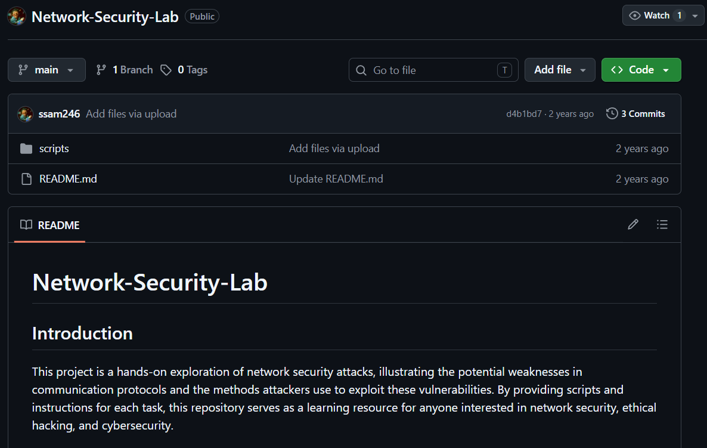
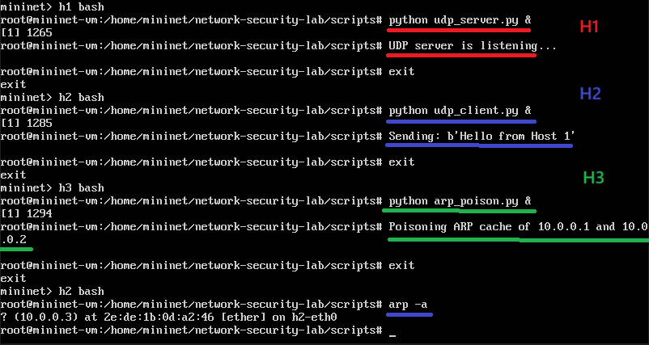
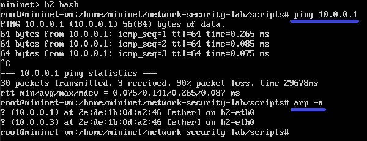
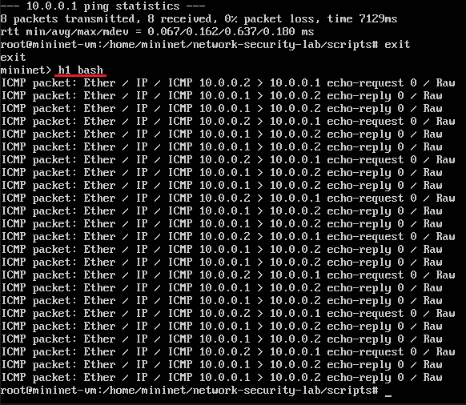
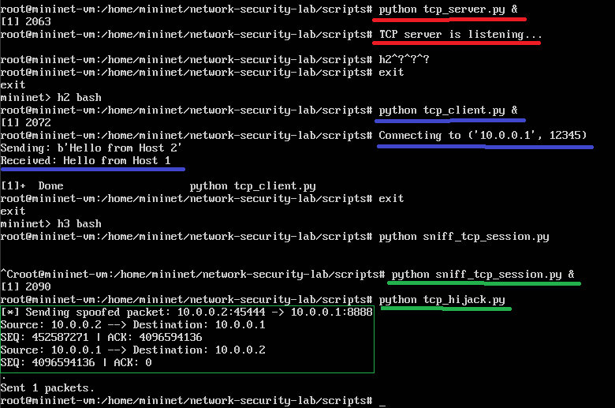

# H5 Laboratorio- ja simulaatioympäristöt hyökkäyksissä  
Testit tehtiin käyttämällä Stephen Sams luotuja skriptejä ja ympäristöä.  
Tämä repo kloonattiin virtuaalikoneelle.   
  

## a) Aja tunnilla esitetty ARP hyökkäys ja tutki, miten se toimii  
  
H1 toimi UDP palvelimena.  
H2 toimii asiakasohjelmana ja lähettää viestin palvelimelle.  
H3 toimii hyökkääjänä ja kohdistaa hyökkäyksen molempiin H1 ja H2.  
H2 ARP-taulussa näkyy tämän jälkeen vain H3 tiedot.  

  
H2 pingasi vielä palvelinta, mutta 90% paketeista eivät menneet läpi.  
H2 ARP-taulu muuttui uudestaan.  

ARP myrkytyksen idea on huijata verkon laitteita ohjaamaan liikennettä väärään MAC-osoitteeseen.  

Mitä tehtiin:  
Host 1  
python udp_server.py  

Host 2  
python udp_client.py  

Host 3  
python arp_poison.py  

Host 2  
Ping 10.0.0.1  

## b) Samassa hakemistossa on myös ICMP Spoofing ja TCP Session Hijacking. Aja molemmat labrat läpi ja kerro, miten molemmat tekniikat toimivat  
### ICMP Spoofing  
  
Koneella H1 oli käynnissä taustalla: python sniff_icmp.py.  
H1 on tarkoitus vain napata paketteja ja näyttää ne.  
H3 tarkoitus oli tehdä spooffaus.  
H2 koneen tarkoitus on tehdä ping viesti. Se tehtiin H3 spooffaus skriptin jälkeen.  

ICMP spooffissa hyökkääjä kuuntelee verkkoa ja lähettää oman ICMP viestin, ennen oikeaa vastausta.  

Mitä tehtiin:  
Host 1  
python sniff_icmp.py  

Host 3
python spoof_icmp.py

Host 2  
ping 10.0.0.1  

 
 
 

### TCP Session Hijacking  
  
H1 kone aloittaa palvelimen ja H2 ottaa yhteyden.  
H3 aloittaa kuunnella liikennettä: python sniff_tcp_session.py.  
H3 on tarkoitus nähdä TCP tiedot: IP, portit.  
H3 teeskentelee konetta H2 ja lähettää paketin.  

Vaikka paketti lähetettiin, vastausta ei näy ja oletan tämän epäonnistuneen.  

 

TCP istunnon kaappauksessa hyökkääjää kaappa istunnon ja esittää toista.  

Mitä tehtiin:  
Host 1  
python tcp_server.py  

Host 2  
python tcp_client.py  

Host 3  
python sniff_tcp_session.py  
python tcp_hijack.py  

## c) Hakemistossa 02-SDN-DDos_Simulation tryout-kansiossa on työkalut, jotta voit ajaa TCP SYN-Flood-hyökkäyksen turvallisesti  
En ehtinyt omasta aikatauluksen syystä käymään läpi tehtävää.  

Github. ssam246. Network-Security-Lab: https://github.com/ssam246/Network-Security-Lab  
