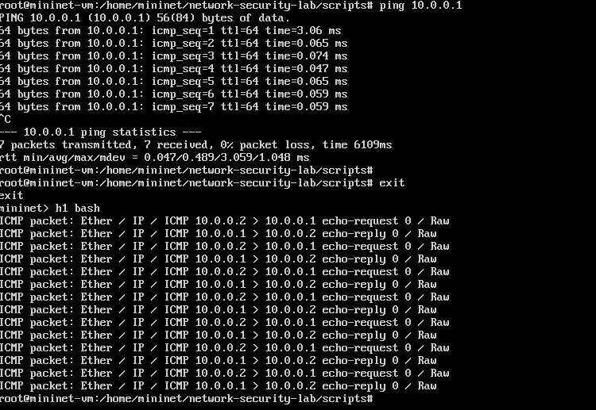

# H5 Laboratorio- ja simulaatioympäristöt hyökkäyksissä  
Testit tehtiin käyttämällä Stephen Sams luotuja skriptejä.  
Tämä repo kloonattiin virtuaalikoneelle.   
  

## a) Aja tunnilla esitetty ARP hyökkäys ja tutki, miten se toimii  
--

## b) Samassa hakemistossa on myös ICMP Spoofing ja TCP Session Hijacking. Aja molemmat labrat läpi ja kerro, miten molemmat tekniikat toimivat  
  
  

Koneella H1 oli käynnissä taustalla: python sniff_icmp.py.  
H2 Koneen tarkoitus on tehdä ping viesti.  

H1 on tarkoitus vain napata paketteja ja näyttää ne.  
-----  

  
H1 kone aloittaa palvelimen ja H2 ottaa yhteyden.  
H3 aloittaa kuunnella liikennettä: python sniff_tcp_session.py.  
H3 on tarkoitus nähdä TCP tiedot: IP, portit.  
H3 teeskentelee konetta H2 ja lähettää paketin.  

 
Vaikka paketti lähetettiin, vastausta ei näy ja oletan tämän epäonnistuneen.  

## c) Hakemistossa 02-SDN-DDos_Simulation tryout-kansiossa on työkalut, jotta voit ajaa TCP SYN-Flood-hyökkäyksen turvallisesti  

- Kirjoita, miten ajoit hyökkäyksen ja miten kyseinen hyökkäys toimii  

Github. ssam246. Network-Security-Lab: https://github.com/ssam246/Network-Security-Lab  
