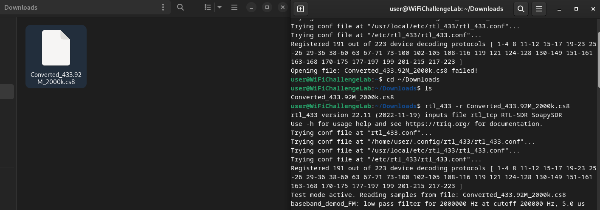
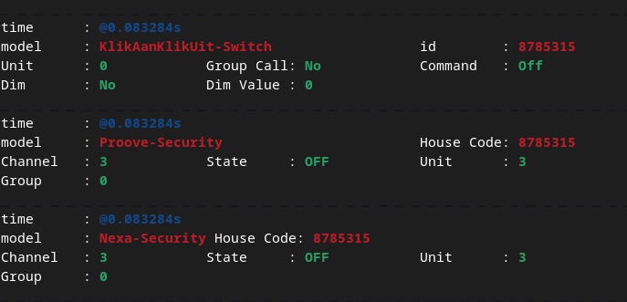
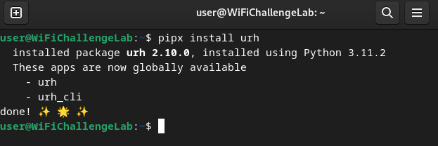
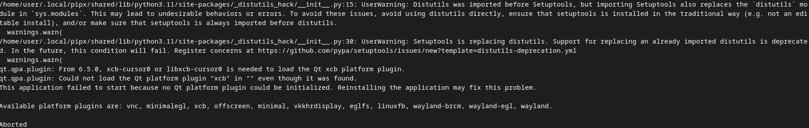
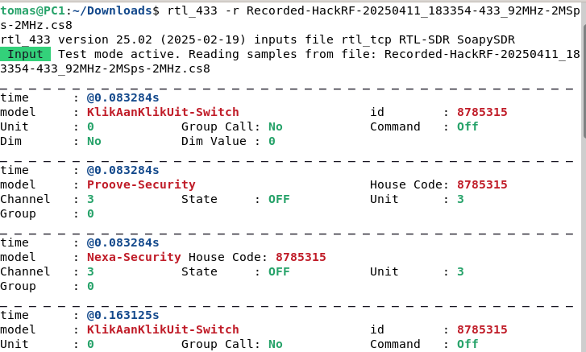
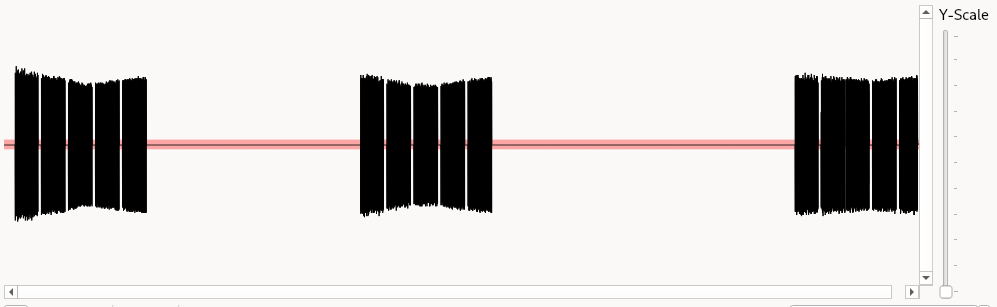
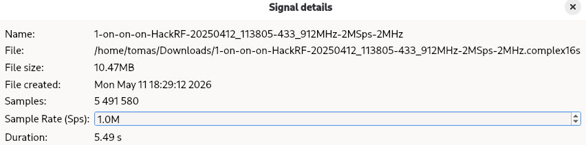
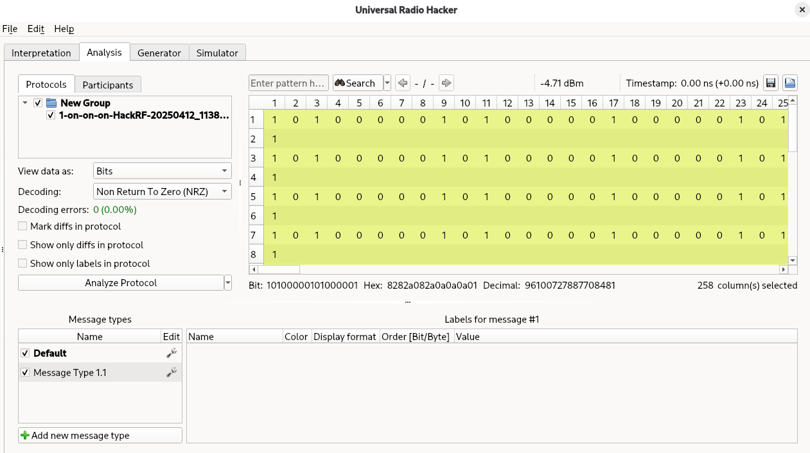

# H7 Aaltoja harjaamassa  
## Tämä ei oikein sujunut, mutta tein toimivan version tästä [täällä](v2)

## x) Lue ja tiivistä  
- Hubacek 2019: Universal Radio Hacker SDR Tutorial on 433 MHz radio plugs
Videolla ohjeistetaan, miten Universal Radio Hacker sovellusta käytetään.
Universal Radio Hacker (URH) avulla siepataan kauko ohjaimen signaali, joka tulee ohjeimen käytöstä.
Signaali kopioidaan omalle ohjaimelle, jonka jälkeen tämä toimii kuin alkuperäinen ohjain.  

- Cornelius 2022: Decode 433.92 MHz weather station data
Sivulla käydään läpi, miten sääaseman radiosignaalia saadaan tutkittua.
Tämä tehdään rtl_433 ja URH ohjelmia hyödyntäen.
URH sisällä on sovellus Spectrum Analyzer. Tämän avulla nähdään nykyiset taajudet ilmassa.
Artikkelissa käydään läpi tämän sovelluksen oikeista asetuksista, ja miten sitä käytetään.  

## a) Laita läppäri valmiiksi lipunryöstöön  
Virtuaalikone EI ole valmis lipunryöstöön.  
rtl_433 toimii, mutta URH ei.  

## b) Asenna rtl_433  
rtl_433 on asennettu. Versio 22.11.

## c) Mitä tässä näytteessä tapahtuu?  
Hyvä muistaa käyttää relatiivista tai absoluuttista polkua. Unohdin tämän aluksi.  
  

 

Tässä on itse näyte. Näyttessä näkyy langaton valokytkin ja kaksi muuta tuntematonta laitetta.  
Kytkimelle tehty käsky oli vain tälle tarkoitettu ja komentona oli sammua.  
Proove ja Nexa laitteista tietona on vain kanava 3, ryhmä 0 ja näiden laitteiden olevan pois päältä.  

  

## d) Muunna näyte rtl_433-yhteensopivaan muotoon ja analysoi se  

## e) Asenna URH, the Ultimate Radio Hacker & Tarkastele näytettä  
Asensin URH Githubin kautta:  
  

Mutta tämän käynnistys ei mitenkään toiminut.  
Yritin luoda korjausta, mutta en ymmärrä.  
Virtuaalikone on aikaisemmin käytetty Wifi Challenge Lab kone, ja ehkä tämä voi olla syy virheeseen?  
  

## f) Yleiskuva. Kuvaile näytettä yleisesti: kuinka pitkä, millä taajuudella, milloin nauhoitettu?  

## g) Demoduloi signaali niin, että saat raakabittejä. Mikä on oikea modulaatio? Miten pitkä yksi raakabitti on ajassa?  

Lähteet:  
Universal Radio Hacker. Github. https://github.com/jopohl/urh#Installation  
Hubacek 2019: https://youtu.be/sbqMqb6FVMY?t=199  
Cornelius 2022: https://www.onetransistor.eu/2022/01/decode-433mhz-ask-signal.html  
ChatGPT käytetty Universal Radio Hacker sovelluksen korjaus yrityksissä.  

--------------------------------------------------------------------------------------------------------------------------------------
--------------------------------------------------------------------------------------------------------------------------------------
--------------------------------------------------------------------------------------------------------------------------------------
--------------------------------------------------------------------------------------------------------------------------------------
--------------------------------------------------------------------------------------------------------------------------------------
--------------------------------------------------------------------------------------------------------------------------------------

# H7 Aaltoja harjaamassa v2  

## x) Lue ja tiivistä  
- Hubacek 2019: Universal Radio Hacker SDR Tutorial on 433 MHz radio plugs
Videolla ohjeistetaan, miten Universal Radio Hacker sovellusta käytetään.
Universal Radio Hacker (URH) avulla siepataan kauko ohjaimen signaali, joka tulee ohjeimen käytöstä.
Signaali kopioidaan omalle ohjaimelle, jonka jälkeen tämä toimii kuin alkuperäinen ohjain.  

- Cornelius 2022: Decode 433.92 MHz weather station data
Sivulla käydään läpi, miten sääaseman radiosignaalia saadaan tutkittua.
Tämä tehdään rtl_433 ja URH ohjelmia hyödyntäen.
URH sisällä on sovellus Spectrum Analyzer. Tämän avulla nähdään nykyiset taajudet ilmassa.
Artikkelissa käydään läpi tämän sovelluksen oikeista asetuksista, ja miten sitä käytetään.  

## a) Laita läppäri valmiiksi lipunryöstöön  
Virtuaalikone ON valmis lipunryöstöön.  
rtl_433 toimii, kuten URH.  

## b) Asenna rtl_433  
rtl_433 on asennettu. Versio 22.11.

## c) Mitä tässä näytteessä tapahtuu?  
Hyvä muistaa käyttää relatiivista tai absoluuttista polkua. Unohdin tämän aluksi.  
  

 

Tässä on itse näyte. Näyttessä näkyy langaton valokytkin ja kaksi muuta tuntematonta laitetta.  
Kytkimelle tehty käsky oli vain tälle tarkoitettu ja komentona oli sammua.  
Proove ja Nexa laitteista tietona on vain kanava 3, ryhmä 0 ja näiden laitteiden olevan pois päältä.  

  

## d) Muunna näyte rtl_433-yhteensopivaan muotoon ja analysoi se  
Muutin näytteen loppuosan .cs8 ja tämän jälkeen se avautui.  
Näyte on sama, kuin edellisen kohdan näyte.  
 <---muista_lisätä  

## e) Asenna URH, the Ultimate Radio Hacker & Tarkastele näytettä  
Asensin URH Githubin ohjeiden avulla komennolla: pipx install urh  

 

Tässä on näyte, jossa pistorasian kaukosäätimen valon 1 ON- nappia on painettu kolmesti.  
Näyte näyttääkin tämän, mutta pieni erikoisuus näkyy viimeisimmässä signaalissa.  
Aluksi se tuntui hieman omituiselta. Tämä saattaa olla vain häiriö lähetyksessä.  
 <---muista_lisätä  

## f) Yleiskuva. Kuvaile näytettä yleisesti: kuinka pitkä, millä taajuudella, milloin nauhoitettu?  
Lähetys on melkein kuusi sekunttia pitkä, taajuus tai nauhoituksen ajankohtaa en saanut selville.  
 <---muista_lisätä  

## g) Demoduloi signaali niin, että saat raakabittejä. Mikä on oikea modulaatio? Miten pitkä yksi raakabitti on ajassa?  
Modulaatio on ASK / OOK, sillä aplitudi toimii päälle ja pois tiloissa.  
Signaali muunnetaan binääriseksi 1 tai 0 jonoksi, jossa korkea amplitudi vastaa bittiä 1 ja matala amplitudi bittiä 0.  
Kaukosäätimien lähettämissä signaalien nopeus on luokkaa 0.2ms - 1.0ms ja näin voidaan arvella yhden bitin kesto on ~0.5 ms.  
 <---muista_lisätä  

Lähteet:  
Universal Radio Hacker. Github. https://github.com/jopohl/urh#Installation  
Hubacek 2019: https://youtu.be/sbqMqb6FVMY?t=199  
Cornelius 2022: https://www.onetransistor.eu/2022/01/decode-433mhz-ask-signal.html  
ChatGPT käytetty Universal Radio Hacker sovelluksen tulkinnassa ja vahvasti kohdassa g)
